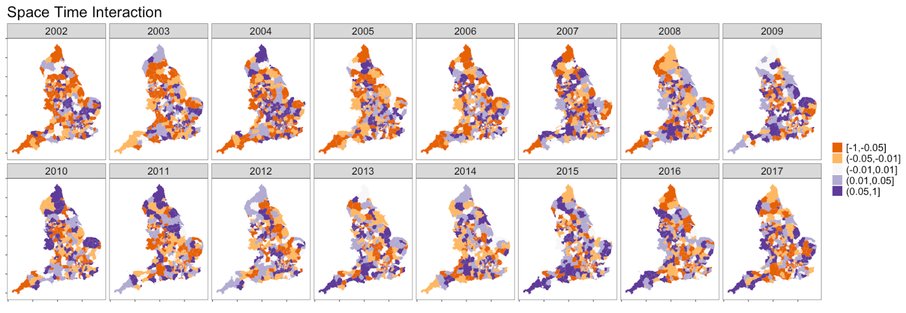

  
\pagenumbering{gobble} 
\pagenumbering{arabic} 

```{r setup, include=FALSE}
knitr::opts_chunk$set(echo = TRUE, message=FALSE, warning=FALSE, fig.align = "center", class.source='klippy', fig.pos = "H")
```


```{r eval=TRUE, echo=FALSE}
# Load the libraries you will use for the mini-project report
library(ggplot2)
library(knitr)
library(kableExtra)
```


# Introduction
Pneumonia is a significant cause of mortality worldwide, despite being a preventable and treatable disease. In the United Kingdom, pneumonia causes over 25,000 deaths each year [@asthma2022pneumonia] Even with advances in healthcare and vaccination, pneumonia continues to impose a substantial burden on healthcare systems. Although national epidemiological studies have identified key factors associated with pneumonia mortality, such as socioeconomic status, there is a limited understanding of these associations at a local level.
Socioeconomic deprivation has been recognised as a key determinant of health outcomes, with pneumonia mortality rates being approximately double in the most deprived communities in England [@office2021inhale]. Lifestyle factors, such as decreased physical activity, have also been proposed as risk factors for pneumonia, with active individuals showing a lower risk of developing severe respiratory infections [@Kunutsor2022]. However, evidence at the local level remains limited.
Using Bayesian spatio-temporal analysis, this study addresses the gap by examining geographic variation and temporal trends in pneumonia mortality across 324 English local authorities from 2002 to 2017.  we employ the BYM2 spatial model to account for both structured spatial dependence and unstructured heterogeneity in pneumonia mortality patterns.
 
The aim is to quantify local variation and trends in pneumonia mortality, and assess the impact of socioeconomic deprivation and population physical activity. We hypothesise that more deprived areas will show higher pneumonia mortality, while areas with higher physical activity levels may show lower mortality.  This study intends to inform targeted public health interventions and improve health outcomes by identifying regions characterised by increased pneumonia mortality and higher deprivation. We aim to identify if socioeconomic deprivation or physical activity levels influence the spatial and temporal patterns of pneumonia mortality across English local authorities.

# Methods

This study used a spatio-temporal ecological design to analyse yearly pneumonia deaths across 322 local authorities in England between 2002 and 2017. The outcome of interest was the count of deaths due to pneumonia in each local authority and year. Expected deaths, provided in the dataset, were calculated through indirect standardisation by age and sex using national rates. These expected values were used as an offset to account for differences in population structure.
 
Two area-level covariates were considered as continuous variables: the Index of Multiple Deprivation (IMD) and the percentage of physically active adults, defined as those exercising for more than 30 minutes on more than three days per week. These were obtained from the Fingertips public health data repository. Both were standardised to have a mean of 0 and a standard deviation of 1 for easier interpretation

Geographic boundaries of the local authorities were obtained via shapefiles, and spatial dependence was defined using a queen contiguity structure. This was converted into an adjacency graph suitable for use in the INLA (Integrated Nested Laplace Approximation) modelling framework.

### Statistical Modelling {-}
Pneumonia deaths were modelled using a hierarchical Bayesian generalised linear model with a Poisson likelihood and log link function. The logarithm of the expected number of deaths was included as an offset to model standardised mortality ratios (SMRs).

Let $y_{it}$ be the observed number of pneumonia deaths in local authority i at year t, and Eit the expected number of deaths. The model is specified as:

$$
\begin{aligned}
y_{it} &\sim \text{Poisson}(\mu_{it}) \\
\log(\mu_{it}) &= \log(E_{it}) + \eta_{it} \\
\eta_{it} &= \beta_0 + \beta_1 \cdot \text{IMD}_i + \beta_2 \cdot \text{PA}_i + u_i + v_t
\end{aligned}
$$
$\mu_{it}$ is the expected mean number of deaths in local authority $i$ at time $t$, $\beta_0$ is the intercept, $\beta_1$ is the regression coefficient for deprivation (IMD), $\beta_2$ is the regression coefficient for physical activity (PA), $u_i$ is the spatial random effect, $v_t$ is the temporal random effect.

### Spatial Random effects {-}

The spatial random effect $u_i$ was modelled using the BYM2, for flexible modelling of both structured spatial dependence and unstructured heterogeneity:

$$
u_i = \frac{1}{\sqrt{\tau_u}} \left( \sqrt{\phi} \cdot s_i^* + \sqrt{1 - \phi} \cdot \epsilon_i^* \right)
$$

Where $s_i^*$ is the standardised structural spatial effect, $\epsilon_i^*$ is the standardised independent and identically distributed (iid) noise, $\phi$ controls the structured spatial variation, $\tau_u$ is the precision.

### Temporal Random Effects {-}
Temporal effects $v_t$ were modelled using a first-order random walk (RW1):

$$
v_t \mid v_{t-1}, \tau_v \sim \mathcal{N}(v_{t-1}, \tau_v^{-1})
$$
With this model, we assume that the risk in each year is similar to the previous one, allowing for a smooth evolution of risk over time, while capturing deviations where supported by the data. All hyperparameters, including $\tau_u$, $\tau_v$, and $\phi$, were assigned penalised complexity (PC) priors, which penalise model complexity in favour of simpler structures unless strongly supported by the data. 


# Results

Depicted in Figure \@ref(fig:table-1), we identified a trend of reduced total deaths from pneumonia between 2002 and 2017. In 2002, the total deaths from pneumonia were 36,730 and in 2017 this number had fallen to 24,800 individuals. Figure \@ref(fig:table-1) also illustrates that the trend of expected deaths was inverse to total deaths. 

```{r table-1, eval=TRUE, echo=FALSE, fig.pos='h', out.width = '0.3\\linewidth', fig.cap="Table highlighting how total deaths fell throughout the study period."}

```

Furthermore, the Standardized Morbidity Ratio (SMR) across England showed some areas depicting spatial autocorrelation including the local authorities in and surrounding London, as well as those near Liverpool and Manchester. These areas are characterised by higher SMRs, and thus higher rates of pneumonia deaths than expected. Conversely, the North, South West, and East depict lower SMRs. 

The initial spatial models, fitted with BYM2, depict the Relative Risks (RRs) and Posterior Probabilities (PPs) after smoothing away random noise. The RRs reinforce the trend observed in our SMRs, evidencing the highest RRs spread across inland areas from London to Manchester and Liverpool. The PPs support the evidence that these cities have the highest relative risks of death by pneumonia. The spatial temporal model depicts a similar pattern of RRs and PPs after accounting for time to the purely spatial model. 

Moreover, Figure \@ref(fig:posterior-summaries-hparams) indicates that the spatially structured component in the purely spatial model explains approximately 40% of the spatial variability, supporting the notion of moderate spatial autocorrelation but conversely suggests a large portion of variability is unexplained by the spatially structured component.

```{r posterior-summaries-hparams, eval=TRUE, echo=FALSE, out.width="70%", fig.cap="Indication that the spatially structured component in the purely spatial model explains approximately 40% of the spatial variability"}

```


After accounting for deprivation and physical activity (both scaled), the RRs depict pronounced changes, with the lower and higher RRs diverging further. The higher RRs are depicted to be higher and the lower RRs drop lower. 
Figure \@ref(fig:st-model-covariates-table), depicting the posterior relative risks for fixed effects, reports an insignificant association between physical activity and pneumonia deaths (as indicated by the credible interval). Contrastingly, deprivation that 1 standard deviation increase in deprivation is associated with a 7.7% higher rate of pneumonia deaths (significant, 95%). The KLD values also indicate the posterior distribution is well approximated from the normal distribution and thus that the covariates add little to the model. 

```{r st-model-covariates-table, eval=TRUE, echo=FALSE, out.width="50%", fig.cap="Posterior relative risks of fixed effects"}

```


The spatio-temporal models with Type 1 interaction further underpin the spatial and temporal characteristics highlighted thus far. The high precision values for both the models with and without covariates (34.46, 40.14) indicate low spatial variability. However, the $\phi$ values for each model indicate strong spatial correlations (76.7%, 85.1%) in the respective models. The precisions for the time components of the models indicates a smooth temporal trend in pneumonia deaths, rather than stark changes between years. This is further reinforced in the Figure \@ref(fig:smooth-and-declining-temporal) (see appendix), depicting the smooth (and declining) temporal residual RRs across the period of study. 

The precision for the combined spatial and temporal terms indicates that the changes experienced across the local authorities are more driven by time than differences in space. This notion is further evidenced by the Figure \@ref(fig:space-time-interaction) (see appendix) which shows no clear pattern of space-time interaction across the local authorities in the period of study. 

Lastly, the WAIC values of all the models facilitate model comparison of the spatio-temporal models (as the spatial model is fundamentally different). The WAIC values indicate the best performing model is the spatial temporal model with 1 time interaction and the covariates (WAIC = . However, the inclusion of the covariates only lowers the WAIC slightly, evidencing their somewhat limited utility. 

# Discussion

There are several key findings from this analysis. Firstly, pneumonia deaths have steadily decreased over time, and this trend is largely consistent across local authorities in England. This negative temporal trend is an overall improvement in pneumonia-caused mortality. Secondly, moderate to high levels of spatial structure were observed, with high spatial correlations and a substantive portion of spatial variability (40%) explained by the spatially structured component in the initial spatial model. Furthermore, consistently higher relative risks of death by pneumonia were observed in London and the North West. To summarise, consistent spatial autocorrelation (and differences) were observed across England, and the changes in these spaces were also consistent over the period of study, decreasing over time. Regarding the inclusion of covariates, deprivation was found to be associated with higher pneumonia mortality rates but not physical activity. The association of deprivation and respiratory diseases, including pneumonia, is also consistent with past literature (@Hawker2003). 


# Conclusion 

Our research has contributed to existing literature by further refining potential areas of focus for understanding spatial temporal differences in pneumonia deaths, principally: 1) temporal trends for pneumonia are observed across space, so by looking into the factors of this decreasing trend would allow us to better approach the challenge of pneumonia (and respiratory deaths) 2) deprivation is a possible factor contributing to consistent differences in pneumonia mortality across space. Future research could investigate spatial temporal trends of deprivation and pneumonia at a more granular geographic scale. 


# Supplementary material

```{r precision-models-with-covariates, eval=TRUE, echo=FALSE, out.width="70%"}

```

```{r precision-models-without-covariates, eval=TRUE, echo=FALSE, out.width="70%"}
knitr::include_graphics("graphics/precision_models_without_covariates.png")
```


```{r smooth-and-declining-temporal, eval=TRUE, echo=FALSE, out.width="70%", fig.cap= "Smooth and declining trend in pneumonia mortality over time"}

```


```{r space-time-interaction, eval=TRUE, echo=FALSE, out.width="90%", fig.cap="No clear pattern of space-time interaction across local authorities in period of study"}

```

# References 


